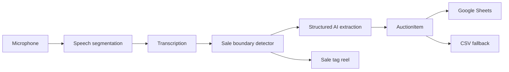

# Auction Assistant

[](https://github.com/milesshoe/auction-assistant/actions/workflows/ci.yml)

Auction Assistant is a production-oriented desktop application for live auction sellers. It listens to a livestream, transcribes natural speech, detects completed sales, extracts structured item data, and maintains a fulfillment-ready sales log without requiring the seller to stop and type.

The interface is optimized for a two-person auction workflow. Its sale-tag reel keeps the item that needs a handwritten tag in the visual foreground, retains the previous sold item as a safety reference, and shows the number currently being auctioned.


> Portfolio project. Auction Assistant is not affiliated with or endorsed by Whatnot.

## What it demonstrates

- Continuous microphone capture with local energy-based speech segmentation
- Concurrent transcription uploads with ordered transcript delivery
- OpenAI Structured Outputs mapped directly into typed Pydantic models
- Deterministic natural-language sale-boundary detection
- Automatic Google Sheets creation, formatting, and row appends
- Local CSV fallback when a remote persistence operation fails
- Background workers that keep network and AI operations off the UI thread
- A PySide6 desktop interface designed around a real fulfillment workflow
- Unit-tested business rules, strict typing, linting, and macOS packaging

## Workflow



The tag reel presents three states in one glance:

1. **Previous sold item** — smaller and dimmed as a just-passed reference.
2. **Item to write down now** — large, green, and paired with a short description.
3. **Item being auctioned** — the current sale number shown below the highlight.

## Data captured

Each completed sale produces an immutable `AuctionItem` containing:

| Field | Purpose |
| --- | --- |
| Sale number | Chronological fulfillment identifier |
| Description | Normalized short item description |
| Size | Clothing or shoe size when spoken |
| Price | Final sale price |
| Buyer | Buyer username |
| Timestamp | Capture time |
| Confidence | AI extraction confidence |
| Review | Flags uncertain or incomplete rows |

Rows that need attention are highlighted in Google Sheets. Missing critical information is treated more prominently than ordinary low-confidence data.

## Project structure

```text
ai/          Structured extraction, prompts, and transcription adapter
audio/       Continuous microphone capture and local speech segmentation
automation/  Deterministic sale-boundary detection
exports/     CSV and remote-persistence coordination
google/      OAuth authentication and Google Sheets integration
lives/       Per-stream storage creation
models/      Typed domain models
ui/          Manual and continuous-listening PySide6 interfaces
tests/       Unit tests for business rules and adapters
```

## Local setup

Requirements:

- Python 3.11 or newer
- An OpenAI API key
- macOS microphone permission for desktop capture
- Optional Google OAuth Desktop credentials for per-stream spreadsheets

```bash
python3 -m venv .venv
source .venv/bin/activate
python -m pip install -r requirements.txt
cp .env.example .env
```

Add local credentials to `.env`. Secret files are ignored by Git and should never be committed.

Run the continuous-listening interface:

```bash
python auto_app.py
```

Run the original cue-based interface:

```bash
python app.py
```

## Quality checks

```bash
python -m pytest -q
python -m ruff check .
python -m mypy .
```

The GitHub Actions workflow runs the same checks for every push and pull request.

## macOS desktop build

```bash
zsh scripts/build_macos_auto_app.sh
```

The build includes a microphone usage description and produces `Auction Assistant Auto.app`. API keys and Google tokens remain in the user's Application Support directory rather than inside the application bundle.

## Reliability choices

- Uncertain sales are flagged for review rather than silently accepted.
- Transcript arrival order is preserved even when uploads run concurrently.
- A late parser result cannot overwrite a newer item in the sale-tag reel.
- Google Sheets failures do not discard the locally captured sale.
- New stream audits are isolated in separately named spreadsheet files.

## Roadmap

- Platform adapters beyond Whatnot-style selling workflows
- Inventory reconciliation and shipping integrations
- Buyer and brand analytics
- Revenue-per-hour reporting
- Vision-assisted item recognition

## License

Released under the [MIT License](LICENSE).
